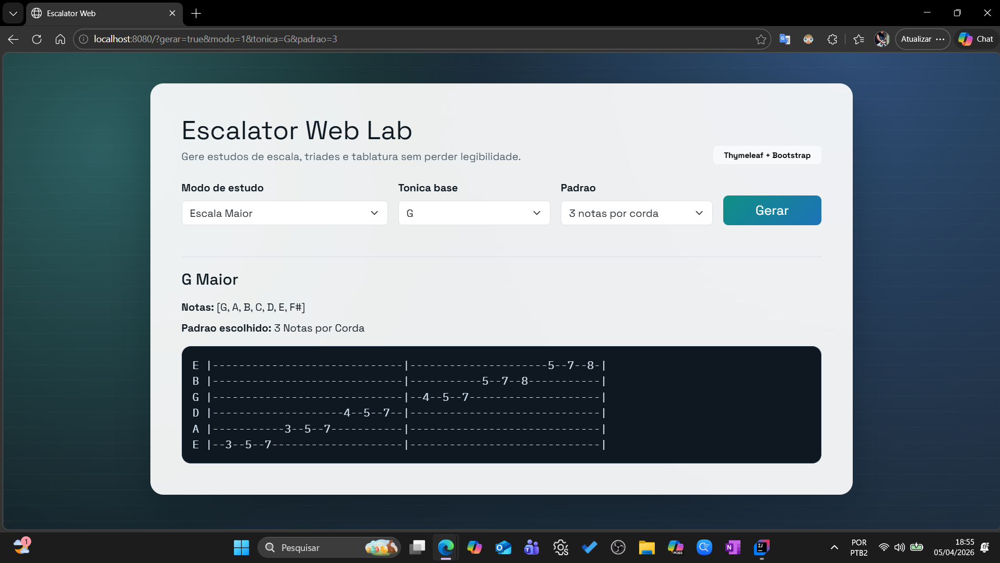

# Escalator

[](https://www.oracle.com/java/technologies/javase-downloads.html)

Aplicacao para geracao de padroes de estudo musical para guitarra, com foco em escalas diatonicas, triades e visualizacao de shapes no braco.

## Principais recursos

- Escala maior e menor natural (relativa).
- Sequencia de 3 notas e triades diatonicas.
- Padrao 3 notas por corda com saida em tablatura.
- Diagrama interativo de 6 cordas e 24 trastes com tonica destacada.
- Conversao de notacao com sustenidos e bemois conforme a tonalidade.



## Estrutura

- `src/main/java/br/com/escalator/model`
- `src/main/java/br/com/escalator/service`
- `src/main/java/br/com/escalator/web`
- `src/main/resources/templates/index.html`
- `src/main/resources/static/css/style.css`

## Stack

- Java 25
- Spring Boot
- Thymeleaf
- Bootstrap
- Maven  

## ▶️ Como Rodar o Projeto

### Pré-requisitos

Certifique-se de ter o **JDK (Java Development Kit)** instalado em sua máquina.

---

### Via Linha de Comando (Bash ou Terminal)

1. **Clone o repositório:**
    ```bash
    git clone https://github.com/mauricioffdev/Escalator-Project.git
    cd Escalator-Project
    ```

2. **Compile o código:**
    ```bash
    mvn clean compile
    ```

3. **Execute o programa:**
    ```bash
    mvn exec:java -Dexec.mainClass="br.com.escalator.App"
    ```

---

## 📂 Estrutura do Código

O projeto segue a arquitetura de pacotes padrão Java (`br.com.escalator`):

| Pacote | Classes | Descrição |
| :--- | :--- | :--- |
| `br.com.escalator` | `App.java` | Contém o método `main()`, o loop principal e a interação com o usuário (`Scanner`). |
| `br.com.escalator.model` | `Nota.java` (Enum) | Define as 12 notas cromáticas e lida com a lógica modular de semitons. |
|  | `Escala.java` | Define a estrutura de uma escala (seus intervalos) e calcula as notas reais. |
| `br.com.escalator.service` | `GeradorDePadroes.java` | Contém a lógica de treino: geração de sequências de N notas e sequência de tríades. |
|  | `GeradorDeTablatura.java` | Gera a visualização da escala maior ou menor em formato de **tablatura para guitarra**, respeitando as posições por corda e traste. Ideal para estudo visual da escala. |

---

## 🧪 Exemplo de Saída

```text
--- Escalator: Gerador de Padrões de Guitarra (Escalas Diatônicas) ---

-------------------------------------------
Escolha o Modo de Estudo:
1 - Escala Maior
2 - Escala Menor Natural (Relativa)
Sua escolha: 1

-------------------------------------------
Notas disponíveis (Ciclos):
Sustenidos: [C, G, D, A, E, B, F#, C#]
Bemóis:     [F, Bb, Eb, Ab, Db, Gb, Cb]
Digite a Tônica MAIOR (ex: C, Bb, A) ou 'Sair': G

-------------------------------------------
Opções de Padrão para G Maior:
1 - Padrão Sequência de 3 Notas
2 - Sequência de Tríades (Campo Harmônico)
3 - 3 Notas por Corda (Tablatura)
Escolha uma opção: 3

----------------- Saída para G Maior -----------------
Notas: [G, A, B, C, D, E, F#]

PADRÃO ESCOLHIDO: 3 Notas por Corda
E |-----------------------------|---------------------5--7--8-|
B |-----------------------------|-----------5--7--8-----------|
G |-----------------------------|--4--5--7--------------------|
D |--------------------4--5--7--|-----------------------------|
A |-----------3--5--7-----------|-----------------------------|
E |--3--5--7--------------------|-----------------------------|

-------------------------------------------
Pressione ENTER para escolher outra escala ou digite 'Sair'.

💡 Observação

Este projeto foi feito com a ajuda do Gemini para resolver erros e implementar a lógica de forma otimizada. 
Os comentários no código-fonte foram mantidos como material de estudo e para facilitar o entendimento de cada etapa.

👨‍💻 Desenvolvido por

Maurício Filadelfo Filho
